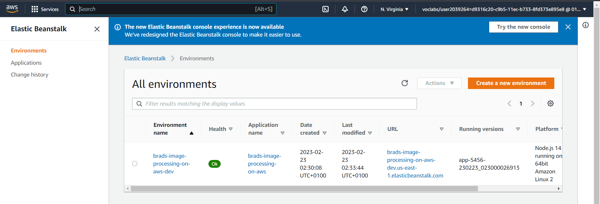
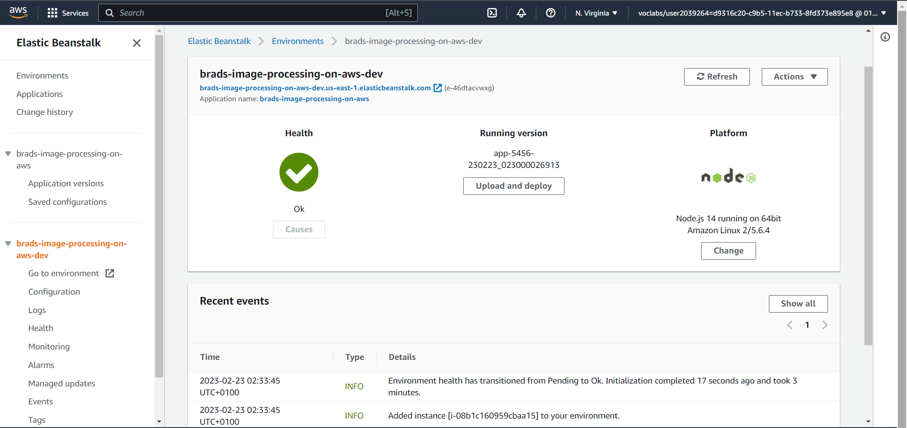

# Image Processing Microservice on AWS

An application that helps the FBI find missing people.  The application uploads images to the FBI cloud database hosted in AWS. This will allow the FBI to run facial recognition software on the images to detect a match.

### Running the application

1. Open a new terminal within the project directory and run `npm i` to install dependencies
2. Run the development server with `npm run dev`

### Try it out
1. Test enpoint on local server => http://localhost:8082/filteredimage?image_url=https://www.rspcansw.org.au/wp-content/uploads/2022/07/KCSAH-web-6142-1.jpg
2. Test endpoint on EB_URL => http://brads-image-processing-on-aws-dev.us-east-1.elasticbeanstalk.com/filteredimage?image_url=https://www.rspcansw.org.au/wp-content/uploads/2022/07/KCSAH-web-6142-1.jpg

### Endpoint URL (EB_URL)

http://brads-image-processing-on-aws-dev.us-east-1.elasticbeanstalk.com

### Deployment Screenshots

